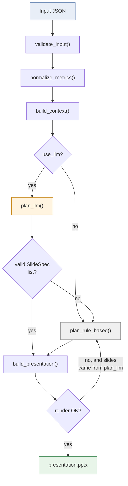

# Design notes

Quick-reference for *why* things are built this way. For setup/usage, see [README.md](README.md).

## Architecture

**AI plans, code renders.** The LLM decides *what the slides should say* (how many, what order,
which chart). Turning that plan into `.pptx` bytes is 100% deterministic — the renderer never
sees raw LLM output, only a `SlideSpec` that already passed pydantic validation.

`plan_rule_based()` has no external dependency, so every arrow into it is a fallback path — it's
the only node guaranteed to succeed.

| Decision | Why |
|---|---|
| LLM never touches rendering | A hallucinated field or wrong type fails pydantic validation and falls back — it never reaches python-pptx. |
| Rendering is pure code, not AI | Same `SlideSpec` in → same `.pptx` bytes out, every time. |
| Rule-based planner always exists | The tool works with zero AI dependency — no API key, no network, still produces a deck. |
| Native PowerPoint charts, not matplotlib images | Editable in PowerPoint (colors, data, type) — a pasted image looks the same but isn't. |

**Libraries used and why:** [README § Libraries & LLM used](README.md#libraries--llm-used).

## Validation & fallback, in one glance

- **`SlideSpec`** (pydantic) is the *only* thing that crosses the LLM trust boundary — it's the
  one model that needs real validation. `Metric` is a plain dataclass; nothing external lands
  there directly.
- **`plan_llm()` returns `None`** on any failure — missing package, missing API key, a raised
  API error, invalid JSON, or a `SlideSpec` validation error — triggering fallback to
  `plan_rule_based()`. `fell_back=True` on the result lets the CLI/UI surface it.
- **Renderer never skips or crashes on bad content** — it degrades instead:
  - No `chart_type` → text-only slide, not a missing one.
  - No `source` → footer reads `"Source unavailable."` instead of going blank.
  - Empty `key_insights` → 2-slide summary-only deck instead of an error.
  - Too many bullets to fit → capped and the rest silently dropped, instead of overflowing off-slide.

## Chart type selection

All four inputs are technically "numbers," but they answer different questions:

| Type | When | Renders as |
|---|---|---|
| `ranking` | Ordered/ranked entities | Horizontal bar, sorted by rank |
| `comparison` | Independent % stats that don't sum to a whole (e.g. "57% said X, 54% said Y") | Horizontal bar |
| `pie` | True part-to-whole: 2–6 values summing to ~100% | Pie, one tint per slice |
| `trend` | A time series | Line, with the key point as a larger marker |

Below 2 or above 6 slices, or values that don't sum to ~100, a would-be pie stays a `comparison`
bar instead — a wrongly-chosen pie is more misleading than a wrongly-chosen bar.

Bars render in one flat color and ignore `highlight` on purpose — uniform by design. `highlight`
only applies to `trend` lines, where per-point emphasis is the actual intent.

## Chart-slide bullets

Default chart slide = chart + one-line `key_message`, no bullets. `plan_rule_based()` always
leaves `bullets=[]`; the LLM planner only adds them when the user's instruction asks for more
detail. Capped at 3 either way — anything beyond that is dropped.

## Known limitations

| Limitation | Trade-off |
|---|---|
| No pytest unit suite | `tests/test_edge_cases.py` proves fallback/degradation end-to-end, which mattered more given the scope. |
| LLM planner isn't deterministic | Inherent to using an LLM for planning. The rule-based planner is the stable baseline. |
| No LLM retry or response caching | Fails fast and degrades to the rule-based planner instead — the safer default for a prototype. |
| Only four chart types | Ranking, comparison, pie, trend cover the sample data; nothing calls for more yet. |
| Pie/comparison heuristic is a simple sum check | Independent stats summing near 100 by coincidence could misfire; the LLM planner is more reliable here since it reads insight text, not just numbers. |
| `_metric_from_raw`'s generic fallback can pick the wrong field | On an unfamiliar metric shape it grabs the first non-numeric field as the label and first numeric field as the value — could silently plot the wrong number (e.g. an `id`). Feeds the chart directly, so this is a real risk, not just cosmetic. |
| Text-overflow guards are heuristic | Bullet caps estimate fit from a fixed line-height, not real font metrics — prevents overflow but isn't pixel-exact. |
| Streamlit preview is minimal | Shows detected categories + a summary; you download the `.pptx` to see the actual deck. |
| Insight-level fields have no alias fallback | `category`/`insight`/`source` are matched by exact key name, unlike metric fields which try several aliases (see `validator._metric_from_raw`). A differently-named export variant would silently produce blank fields instead of erroring. |
| `key_message`/`bullets` aren't length-validated | Unlike `KpiCard` fields (`models.py`), an overly long LLM-generated field degrades visually via the renderer's truncation rather than failing validation. |

## Possible future extensions

- **Swap in Google Slides rendering** — the renderer only ever consumes validated `SlideSpec`, so
  a `render_google_slides()` alongside `build_presentation()` needs zero changes upstream.
- **Theme/branding as a parameter** — the constants at the top of `renderer.py` (accent color,
  font, dimensions) could become a client/brand picker instead of being fixed.
- **Multi-turn refinement** — regenerate one slide from a follow-up instruction instead of the
  whole deck.
- **Slide-level LLM retry with schema feedback** — feed a `ValidationError` back to the model and
  ask it to fix just the invalid slide, instead of falling back to the rule-based planner outright.
