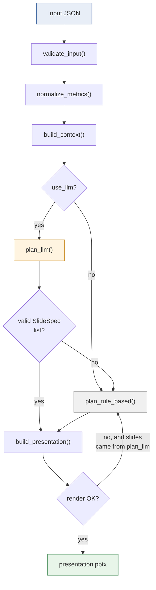

# Design notes

Quick-reference for *why* things are built this way. For setup/usage, see [README.md](README.md).

## The one architectural decision everything else follows

**AI plans, code renders.** The LLM decides *what the slides should say* (how many, what order,
which chart). Turning that plan into `.pptx` bytes is 100% deterministic — the renderer never
sees raw LLM output, only a `SlideSpec` that already passed pydantic validation.

`plan_rule_based()` has no external dependency, so every arrow into it is a fallback path — it's
the only node guaranteed to succeed.

| Decision | Why |
|---|---|
| LLM never touches rendering | A hallucinated field or wrong type can't crash python-pptx or produce a broken slide — it fails pydantic validation first and falls back instead. |
| Rendering is pure code, not AI | Same `SlideSpec` in → same `.pptx` bytes out, every time. A presentation tool that sometimes fails to render isn't usable. |
| Rule-based planner always exists | Guarantees the tool works with zero AI dependency — no API key, no network, still produces a deck. |
| Native PowerPoint charts, not matplotlib images | A Statista employee can click a chart and edit colors/data/type in PowerPoint itself. A pasted image looks the same but isn't editable — defeats the point of handing off a *usable* artifact. |

## Validation & fallback, in one glance

- **`SlideSpec`** (pydantic) is the *only* thing that crosses the LLM trust boundary — it's the
  one model that needs real validation. `Metric` is a plain dataclass; nothing external lands
  there directly.
- **`plan_llm()` returns `None`** (triggering fallback to `plan_rule_based()`) if: the package
  isn't installed, `GEMINI_API_KEY` is missing, the API call raises, the response isn't valid
  JSON, or any slide fails `SlideSpec` validation. `main.generate_presentation()` sets
  `fell_back=True` so the CLI/UI can surface it.
- **Renderer never skips or crashes on bad content** — it degrades instead:
  - No `chart_type` → text-only slide, not a missing one.
  - No `source` → footer reads `"Source unavailable."` instead of going blank.
  - Empty `key_insights` → 2-slide summary-only deck instead of an error.
  - Too many bullets to fit → capped with a `"+ N more"` line instead of overflowing off-slide.

**Rank-vs-percentage rule** (`validator._metric_from_raw`, reapplied in
`planner._chart_type_for_metrics`): when a metric has both a `rank` and a `percentage` (e.g. a
brand ranking that also reports market share), `rank` wins and the metric — and its whole slide —
renders as a ranking chart. Ordering is the more meaningful signal for a ranked list.

## Chart types — matched to what the data *means*, not its surface shape

All four inputs are technically "numbers," but they answer different questions:

| Type | When | Renders as |
|---|---|---|
| `ranking` | Ordered/ranked entities | Horizontal bar, sorted by rank |
| `comparison` | Independent % stats that don't sum to a whole (e.g. "57% said X, 54% said Y") | Horizontal bar |
| `pie` | True part-to-whole: 2–6 values summing to ~100% | Pie, one tint per slice |
| `trend` | A time series | Line, with the key point as a larger marker |

Below 2 or above 6 slices, or values that don't sum to ~100, a would-be pie stays a `comparison`
bar instead — an incorrectly-chosen pie is more misleading than an incorrectly-chosen bar. The
rule-based planner detects this with a sum check (`_looks_like_part_to_whole`); the LLM planner is
told the same rule in its prompt.

Bars render in one flat color and ignore `highlight` on purpose — uniform by design. `highlight`
only applies to `trend` lines, where per-point emphasis is the actual intent.

## Bullets on chart slides are opt-in

Default chart slide = chart + one-line `key_message`, no bullets — matching the "clean,
data-first" brief. `plan_rule_based()` always leaves `bullets=[]`. The LLM planner only fills
`bullets` in when the user's instruction asks for more detail (e.g. "detailed", "with summary of
every sector") — that judgment call belongs to the planner, not the renderer. Either way, bullets
are capped at 3 with a "+N more" overflow, so a verbose LLM response can't push into the footer.

## Known limitations

| Limitation | Why it's acceptable here |
|---|---|
| No pytest unit suite | `tests/test_edge_cases.py` proves fallback/degradation end-to-end; given the scope, that mattered more than isolated unit coverage. |
| LLM planner isn't deterministic | Inherent to using an LLM for planning — same input can yield different slide counts/wording. The rule-based planner is the stable baseline. |
| No LLM retry or response caching | A transient failure falls back immediately (fail fast, degrade gracefully) rather than retrying — the safer default for a prototype. |
| Only four chart types | Ranking, comparison, pie, trend cover the sample data. Stacked bar/scatter aren't wired up — nothing calls for them yet. |
| Pie/comparison heuristic is a simple sum check | Right for genuine splits (market share by region), but independent stats summing near 100 by coincidence could misfire. The LLM planner is more reliable here since it reads insight text, not just numbers. |
| Text-overflow guards are heuristic | Bullet caps estimate fit from a fixed line-height, not real font metrics. Prevents the worst case (running off-slide) but isn't pixel-exact. |
| Streamlit preview is minimal | Shows detected categories + a summary, no in-browser slide preview — you download the `.pptx` to see it. |

## Libraries used and why

| Library | Why |
|---|---|
| **python-pptx** | Only Python library with a real *native* chart API — not a pasted-in image. |
| **pydantic** | Validates `SlideSpec` (the LLM trust boundary) and generates the prompt's JSON schema from the model itself, so prompt and schema can't drift apart. |
| **langchain-google-genai** | Thin wrapper for one one-shot `invoke()` call in `plan_llm()` — no chains, agents, or LangGraph. |
| **python-dotenv** | Loads `GEMINI_API_KEY` from `.env` instead of requiring a shell export. |
| **streamlit** | The UI is one form (upload, text, checkbox, button, download) — Streamlit covers it in well under 100 lines, no frontend build. |

## Possible future extensions

- **Swap in Google Slides rendering** — the renderer only ever consumes validated `SlideSpec`, so
  a `render_google_slides()` alongside `build_presentation()` needs zero changes upstream.
- **Theme/branding as a parameter** — the constants at the top of `renderer.py` (accent color,
  font, dimensions) could become a client/brand picker instead of being fixed.
- **Multi-turn refinement** — regenerate one slide from a follow-up instruction instead of the
  whole deck.
- **Slide-level LLM retry with schema feedback** — feed a `ValidationError` back to the model and
  ask it to fix just the invalid slide, instead of falling back to the rule-based planner outright.
